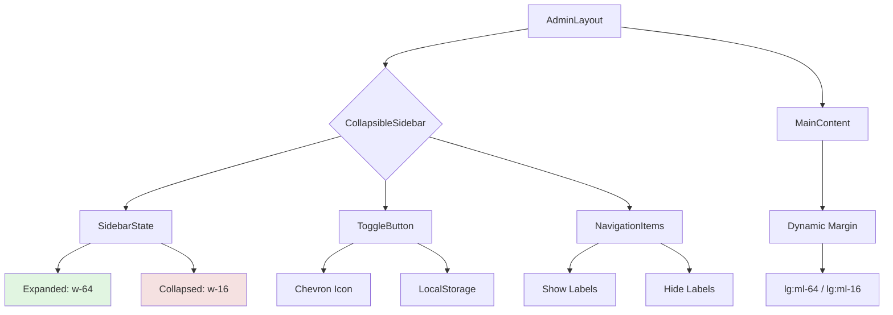

# Admin Portal Flexible Sidebar Implementation Plan

## Current State Analysis
- **File**: `app/admin/layout.tsx`
- **Current Sidebar**: Fixed positioning (`fixed`), width `w-64` (256px), always visible on desktop
- **Main Content**: Has `lg:ml-64` margin to accommodate sidebar
- **Mobile**: Sidebar hidden (`hidden lg:block`), content full-width
- **Issue**: Sidebar is "fixed" - cannot be collapsed or toggled

## Solution: Collapsible Flexible Sidebar

### 1. Create CollapsibleSidebar Component
**Location**: `components/admin/CollapsibleSidebar.tsx`
**Features**:
- Client component with `"use client"` directive
- Toggle state management with localStorage persistence
- Two states: Expanded (256px) and Collapsed (64px)
- Smooth CSS transitions for width changes
- Responsive design (collapsed by default on mobile)

### 2. State Management Design
```typescript
interface SidebarState {
  isCollapsed: boolean;
  toggleSidebar: () => void;
}
```
- Use `useState` with `localStorage` for persistence
- Default: Expanded on desktop, collapsed on mobile
- Store preference in `localStorage` as `admin-sidebar-collapsed`

### 3. Toggle Button Implementation
**Placement**: Top-right corner of sidebar header
**Design**:
- Chevron icon (`ChevronLeft`/`ChevronRight` from lucide-react)
- Rotates 180° based on state
- Tooltip on hover: "Collapse sidebar" / "Expand sidebar"
- Accessible with `aria-label`

### 4. Sidebar Layout Changes
**Expanded State (current)**:
- Width: `w-64` (256px)
- Show full navigation labels
- Show user profile section

**Collapsed State**:
- Width: `w-16` (64px)
- Show only icons (center-aligned)
- Hide navigation labels
- Compact user profile (initials only)

### 5. Main Content Adjustment
**Current**: `lg:ml-64` (fixed margin)
**New**: Dynamic margin based on sidebar state
- Expanded: `lg:ml-64`
- Collapsed: `lg:ml-16`
- Transition: `transition-margin duration-300`

### 6. Responsive Behavior
**Mobile (< lg)**:
- Sidebar hidden (current behavior preserved)
- Hamburger menu in navbar to show mobile drawer
- Content full-width

**Desktop (≥ lg)**:
- Sidebar visible with toggle capability
- Remember user preference

### 7. Implementation Steps

#### Step 1: Create CollapsibleSidebar Component
```tsx
// components/admin/CollapsibleSidebar.tsx
"use client"
import { useState, useEffect } from "react"
import { ChevronLeft, ChevronRight, ... } from "lucide-react"
// ... implementation
```

#### Step 2: Update Admin Layout
- Convert `app/admin/layout.tsx` to client component or use wrapper
- Replace fixed sidebar with CollapsibleSidebar
- Update main content margin logic

#### Step 3: Add CSS Transitions
```css
/* In globals.css or component */
.sidebar-transition {
  transition: width 300ms cubic-bezier(0.4, 0, 0.2, 1);
}
.content-transition {
  transition: margin-left 300ms cubic-bezier(0.4, 0, 0.2, 1);
}
```

#### Step 4: Mobile Drawer (Optional Enhancement)
- Add hamburger menu to admin navbar
- Implement mobile drawer for sidebar on small screens

### 8. Accessibility Considerations
- **Keyboard Navigation**: Tab through sidebar items
- **Screen Readers**: `aria-expanded` on toggle button
- **Focus Management**: Maintain focus when toggling
- **Color Contrast**: Ensure sufficient contrast in both states

### 9. Testing Plan
1. **Visual Testing**: Verify transitions are smooth
2. **State Persistence**: Refresh page maintains collapsed/expanded state
3. **Responsive Testing**: Mobile, tablet, desktop breakpoints
4. **Accessibility Testing**: Keyboard navigation, screen readers
5. **Browser Compatibility**: Chrome, Firefox, Safari

### 10. Files to Modify
1. `app/admin/layout.tsx` - Main layout updates
2. `components/admin/CollapsibleSidebar.tsx` - New component
3. `app/globals.css` - Additional transition styles (optional)
4. `components/layout/Navbar.tsx` - Add mobile toggle (optional)

## Mermaid Diagram: Component Architecture



## Success Criteria
- [ ] Sidebar can be toggled between expanded/collapsed states
- [ ] State persists across page refreshes
- [ ] Smooth CSS transitions (300ms)
- [ ] Responsive behavior maintained
- [ ] Accessible to keyboard and screen readers
- [ ] No breaking changes to existing functionality

## Estimated Implementation Time
Ready for immediate implementation in Code mode.