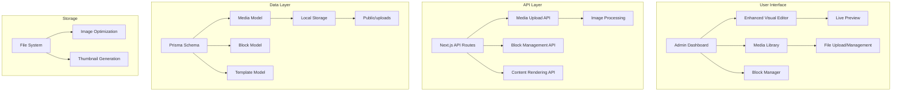

# Powerful WordPress/Elementor-like CMS Implementation Plan

## Executive Summary
This plan outlines the development of a comprehensive CMS system with WordPress-like capabilities and Elementor-style visual editing, built on top of your existing Next.js/Prisma/Tiptap foundation. The system will include a media library, block-based editor, template system, and extensible architecture.

## Current System Analysis
- **Tech Stack**: Next.js 16.2.1, React 19, TypeScript, Prisma (PostgreSQL), Tiptap editor
- **Existing Features**: Basic post management, Tiptap editor, admin dashboard, user roles
- **Gaps Identified**: No media library, limited visual editing, no block system, no plugin architecture

## Architecture Overview



## Core Features

### 1. Media Library
- **Storage**: Local file system with `public/uploads/YYYY/MM/DD/` structure
- **File Types**: Images (JPG, PNG, WebP, SVG), PDFs, documents
- **Image Processing**: Auto-resize, optimization, thumbnail generation
- **Management**: Search, filter, bulk actions, metadata editing
- **Integration**: Direct insert into editor, featured image selection

### 2. Block-Based Visual Editor
- **Block Types**: Text, Image, Heading, Columns, Layout, Interactive
- **Editor Features**: Drag-to-add, contextual settings, live preview
- **Templates**: Pre-designed block combinations, save custom templates
- **Responsive**: Mobile/tablet/desktop preview modes

### 3. Enhanced Content Management
- **Content Types**: Posts, Pages, Custom post types
- **Workflow**: Draft → Review → Approved → Published
- **SEO Tools**: Meta tags, Open Graph, schema markup
- **Revision History**: Version tracking and rollback

## Database Schema Extensions

### New Models:
```prisma
model Media {
  id          String   @id @default(cuid())
  filename    String
  path        String
  url         String
  mimeType    String
  size        Int
  width       Int?
  height      Int?
  altText     String?
  uploadedBy  String
  uploadedAt  DateTime @default(now())
}

model ContentBlock {
  id          String   @id @default(cuid())
  type        String
  data        Json
  attributes  Json?
  order       Int
  parentId    String?
  postId      String?
  createdAt   DateTime @default(now())
}

model BlockTemplate {
  id          String   @id @default(cuid())
  name        String
  type        String
  preview     String?
  data        Json
  category    String
  isPublic    Boolean  @default(true)
  createdBy   String
}

model Page {
  id          String   @id @default(cuid())
  title       String
  slug        String   @unique
  content     Json?
  htmlContent String?
  status      PageStatus @default(DRAFT)
  authorId    String
  publishedAt DateTime?
}
```

## API Routes Structure

```
app/api/
├── media/upload/route.ts          # File upload
├── media/[id]/route.ts           # Media management
├── media/list/route.ts           # Paginated listing
├── blocks/route.ts               # Block CRUD
├── blocks/templates/route.ts     # Template management
├── pages/route.ts                # Page CRUD
└── editor/preview/route.ts       # Live preview
```

## User Interface Components

### 1. MediaLibrary Component
- Drag & drop upload zone
- Grid/List view toggle
- Search and filtering
- Bulk actions (delete, download)
- Metadata editor

### 2. EnhancedEditor Component
- Block sidebar with drag-to-add
- Contextual settings panel
- Live preview pane
- Responsive breakpoint switcher
- Template library browser

### 3. Block Components
- TextBlock, ImageBlock, HeadingBlock
- ColumnsBlock, ContainerBlock
- CalculatorBlock (reuse existing)
- ChartBlock, FormBlock

## Implementation Roadmap

### Phase 1: Foundation (2 weeks)
- Database schema extensions and migrations
- File storage infrastructure
- Basic media upload API

### Phase 2: Media Library (2 weeks)
- Complete media management API
- MediaLibrary UI component
- Integration with existing editor

### Phase 3: Block System (2 weeks)
- Block architecture and registry
- Core block components
- Block rendering engine

### Phase 4: Enhanced Editor (2 weeks)
- Tiptap extensions for blocks
- Visual editor interface
- Template system

### Phase 5: Integration & Polish (2 weeks)
- Integration with existing CMS
- Performance optimization
- Testing and documentation

### Phase 6: Advanced Features (Future)
- Plugin system
- Theme system
- Workflow management
- Multi-language support

## Technical Considerations

### Performance
- Image lazy loading and optimization
- Virtual scrolling for large media libraries
- Block rendering performance optimization
- Caching strategies for frequently accessed content

### Security
- File upload validation (type, size, malware)
- Secure filename generation
- Role-based access control
- Rate limiting for uploads

### Scalability
- Modular architecture for future extensions
- Database indexing strategy
- File storage organization
- CDN integration potential

## Success Metrics
1. **Editor Efficiency**: Reduce content creation time by 40%
2. **Media Management**: Centralize 100% of media assets
3. **Content Flexibility**: Support any content type via blocks
4. **User Satisfaction**: Achieve 4.5/5 editor UX score

## Risks and Mitigation
- **Backward Compatibility**: Maintain existing markdown content with conversion tools
- **Performance Impact**: Implement gradual loading and virtualization
- **Learning Curve**: Provide comprehensive documentation and training
- **Storage Growth**: Implement automatic cleanup and archiving policies

## Next Steps
1. Review and approve this architecture plan
2. Begin Phase 1 implementation (database and file storage)
3. Schedule regular progress reviews
4. Plan user testing and feedback cycles

## Estimated Timeline
- **Total Development Time**: 10 weeks (full-time equivalent)
- **Phased Rollout**: Features can be released incrementally
- **Maintenance**: Ongoing support and feature enhancements

---

*This plan provides a comprehensive roadmap for building a powerful WordPress/Elementor-like CMS that leverages your existing infrastructure while adding the advanced features you requested.*